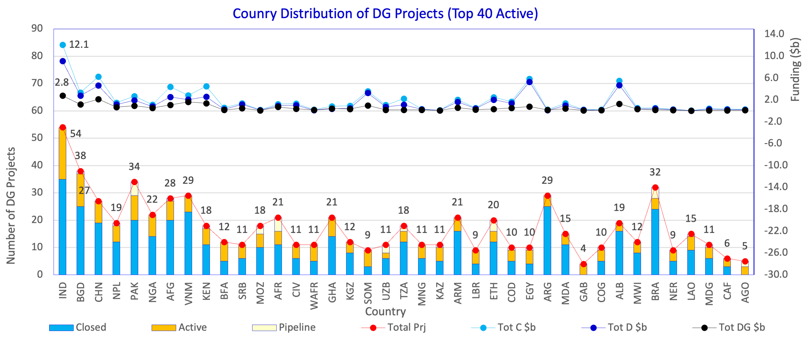
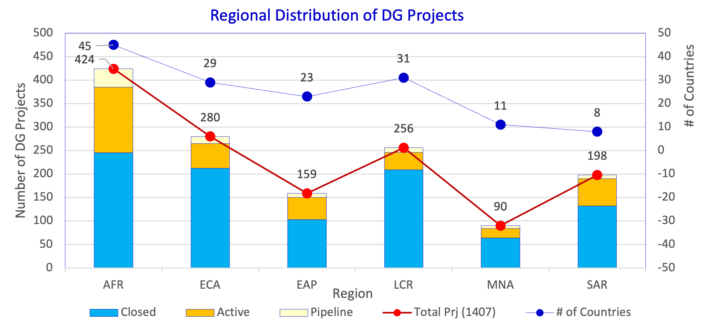

<html>
  <head>
    <strong>FINAL PROJECT PART 3.1</strong>
  </head>
  

    

  
  
 Source: <a href="https://datacatalog.worldbank.org/search/dataset/0038056/Digital-Governance-Projects-Database">Digital Governance Projects Database </a>

  
 The above visualisation represents the country wise distribution of digital governance projects funded by the world bank.
  Each stacked bar graph represents the number of projects by their status i.e, <strong>Closed</strong>, <strong>Active</strong>, <strong>Pipeline</strong>, by country. 
  Additionally, there are markers to depict Funding numbers in <strong>billion dollars ($b)</strong> 

  
  

    

  
  
 Source: <a href="https://datacatalog.worldbank.org/search/dataset/0038056/Digital-Governance-Projects-Database">Digital Governance Projects Database </a>

  
 The above visualisation represents the regional distribution of digital governance projects funded by the world bank.
  Each stacked bar graph represents the number of projects by their status i.e, <strong>Closed</strong>, <strong>Active</strong>, <strong>Pipeline</strong>, by region.

    
  
<strong>AFR:</strong> AFRICA

  
<strong>ECA:</strong>EUROPE AND CENTRAL ASIA

  
<strong>EAP:</strong>EAST ASIA and the PACIFIC

  
<strong>LCR:</strong>LATIN AMERICA and CARIBBEAN REGION

  
<strong>MNA:</strong>MIDDLE EAST and NORTH AFRICA

  
<strong>SAR:</strong>SOUTH ASIA

  Additionally, there are markers to depict Funding numbers in <strong>billion dollars ($b)</strong> 

</html>

