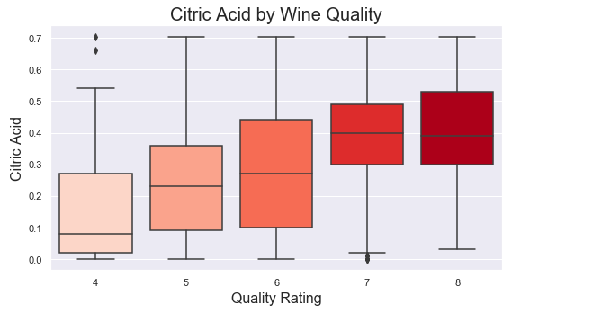

<!DOCTYPE html>
<html>
  <head>
    <strong> WEEKLY VIZ SUBMISSION </strong>
  </head>
  

    

  
  
 Source: <a href="https://www.w3schools.com](https://mrtjwhipple.medium.com/wine-quality-eda-da7c3912b589">Wine Quality</a>

  
 The above visualisation is a bar plot drawn to understand the relationship between "Citric level" and "Wine Quality".Citric acid is added to 
give ‘freshness’ and flavor to wines.
High rated wines have higher citric acid levels and tend to be in a tighter range than the lower rated wines

</html>

