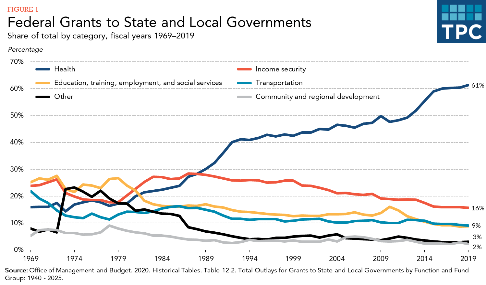

<html>
  <head>
    <strong> FINAL PROJECT PART 3.1 </strong>
  </head>
  

    

  
  
 Source: <a href="[https://www.w3schools.com](https://mrtjwhipple.medium.com/wine-quality-eda-da7c3912b589](https://www.taxpolicycenter.org/briefing-book/what-types-federal-grants-are-made-state-and-local-governments-and-how-do-they-work)">FEDERAL GRANT TO STATE AND LOCAL GOVERNMENTS</a>

  
 The above visualisation is a line chart visualization of the federal grants disbursed to state and local governmnets for various categories mentioned. 
    The federal government distributed about $721 billion (about 16 percent of its budget) to states and localities in fiscal year 2019, providing about one-quarter of these governments’ total revenues. About 61 percent of those funds were dedicated to health care, 16 percent to income security programs, and 9 percent each to transportation and education, training, employment, and social services

</html>

